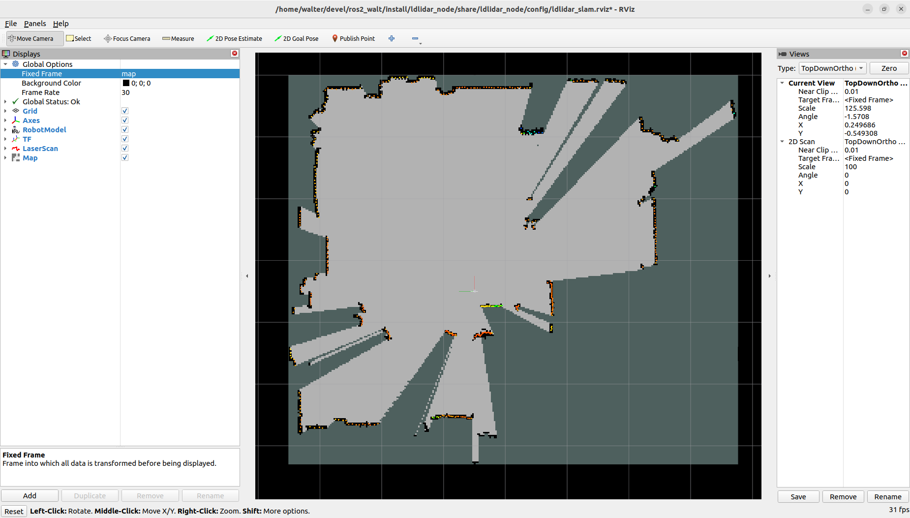

# LD Lidar ROS 2 Package

## ROS 2 package for LDRobot lidar - Based on Nav2 Lifecycle nodes

[Get the Lidar](#get-the-lidar) • [YouTube Videos](#the-node-in-action) • [Install](#install-the-node) • [Start the Node](#start-the-node) • [Parameters](#parameters) • [RViz2](#display-scan-on-rviz2) • [Robot Integration](#integrate-the-node-in-your-robot) • [Benchmarking](#benchmarking)

This package is designed to work with the DToF 2D Lidar sensors [LD19](https://www.ldrobot.com/product/en/112) made by [LDRobot](https://www.ldrobot.com/en).

It can work also with the [LD06](https://www.ldrobot.com/product/en/98) model, but no tests have been performed with it. LD06 cannot work outdoor.

LD19             |  LD06
:-------------------------:|:-------------------------:
  |  

## Get the lidar

My lidar (LD19) comes from the [LDRobot kickstarter campaing](https://www.kickstarter.com/projects/ldrobot/ld-air-lidar-360-tof-sensor-for-all-robotic-applications) ended in 2021.

LDRobot then created also an [Indiegogo campaign](https://www.indiegogo.com/projects/ld-air-lidar-tof-sensor-for-robotic-applications--3#/) for the LD19.

LDRobot today distributes the Lidar through third-party resellers:

* Waveshare: [LD19](https://www.waveshare.com/wiki/DTOF_LIDAR_LD19)
* Innomaker: [LD06](https://www.inno-maker.com/product/lidar-ld06/)
* Other: [Search on Google](https://www.google.com/search?q=ld19+lidar&newwindow=1&sxsrf=ALiCzsb2xd4qTTA78N00mP9-PP5HY4axZw:1669710673586&source=lnms&tbm=shop&sa=X&ved=2ahUKEwjYns78_NL7AhVLVfEDHf2PDk8Q_AUoA3oECAIQBQ&cshid=1669710734415350&biw=1862&bih=882&dpr=1)

## The node in action

LD19 Lifecycle            |  LD19 outdoor
:-------------------------:|:-------------------------:
 | 

## Install the node

The node is designed to work with

* [ROS 2 Humble](https://docs.ros.org/en/humble/index.html)
* [ROS 2 Jazzy](https://docs.ros.org/en/jazzy/index.html)

Clone the repository in your ROS2 workspace:

    cd ~/ros2_ws/src/ #use your current ros2 workspace folder
    git clone https://github.com/Myzhar/ldrobot-lidar-ros2.git

Add dependencies:

    sudo apt install libudev-dev

Install the udev rules

    cd ~/ros2_ws/src/ldrobot-lidar-ros2/scripts/
    ./create_udev_rules.sh

Build the packages:

    cd ~/ros2_ws/
    rosdep install --from-paths src --ignore-src -r -y
    colcon build --symlink-install --cmake-args=-DCMAKE_BUILD_TYPE=Release

Update the environment variables:

    echo source $(pwd)/install/local_setup.bash >> ~/.bashrc
    source ~/.bashrc

## Start the node

### Lifecycle

The `ldlidar` node is based on the [`ROS2 lifecycle` architecture](https://design.ros2.org/articles/node_lifecycle.html), hence it starts in the `UNCONFIGURED` state.
To configure the node, load all the parameters, establish a connection, and activate the scan publisher, the lifecycle services must be called in sequence.

Open a new terminal console and enter the following command:

    ros2 lifecycle set /lidar_node configure

If the node is correctly configured and the connection is established, `Transitioning successful` is returned. If there are errors, `Transitioning failed` is returned. Check the node log for details on any connection issues.

The node is now in the `INACTIVE` state, enter the following command to activate:

    ros2 lifecycle set /lidar_node activate
    
The node is now activated and the `/ldlidar_node/scan` topic of type `sensor_msgs/msg/LaserScan` is available to be subscribed.

### Launch file with YAML parameters

The default values of the [parameters of the node](#parameters) can be modified by editing the file [`ldlidar.yaml`](ldlidar_node/config/ldlidar.yaml).

Open a terminal console and enter the following command to start the node with customized parameters:

    ros2 launch ldlidar_node ldlidar_bringup.launch.py

The [`ldlidar_bringup.launch.py`](ldlidar_node/launch/ldlidar_bringup.launch.py) starts a ROS 2 Container, which loads the LDLidar Component as a plugin.

The [`ldlidar_bringup.launch.py`](ldlidar_node/launch/ldlidar_bringup.launch.py) script also starts a `robot_state_publisher` node that provides the static TF transform of the LDLidar [`ldlidar_base`->`ldlidar_link`], and provides the ldlidar description in the `/robot_description`.

### Launch file with YAML parameters and Lifecycle manager

Thanks to the [NAV2](https://navigation.ros.org/index.html) project, you can launch a [`lifecycle_manager`](https://navigation.ros.org/configuration/packages/configuring-lifecycle.html) node that handles the state transitions described above.
An example launch file, [`ldlidar_with_mgr.launch.py`](ldlidar_node/launch/ldlidar_with_mgr.launch.py), demonstrates how to start the `ldlidar_node` with parameters loaded from the `ldlidar.yaml` file. It also starts the `lifecycle_manager`, configured with the [`lifecycle_mgr.yaml`](ldlidar_node/config/lifecycle_mgr.yaml) file, to automatically manage the lifecycle transitions:

    ros2 launch ldlidar_node ldlidar_with_mgr.launch.py

The `ldlidar_with_mgr.launch.py` script automatically starts the `ldlidar_node` by including the `ldlidar_bringup.launch.py` launch file.

## Parameters

Following the list of node parameters:

* **`general.debug_mode`**: set to `true` to activate debug messages
* **`comm.serial_port`**: the serial port path
* **`comm.baudrate`**: the serial port baudrate
* **`comm.timeout_msec`**: the serial communication timeout in milliseconds
* **`lidar.model`**: Lidar model [LDLiDAR_LD06, LDLiDAR_LD19, LDLiDAR_STL27L]
* **`lidar.rot_verse`**: The rotation verse. Use clockwise if the lidar is mounted upsidedown. [CW, CCW]
* **`lidar.units`**: distance measurement units [M, CM, MM]
* **`lidar.frame_id`**: TF frame name for the lidar
* **`lidar.bins`**: set to 0 for dinamic scan size according to rotation speed, set to a fixed value [e.g. 455] for compatibility with SLAM Toolbox
* **`lidar.range_min`**: minimum scan distance
* **`lidar.range_max`**: maximum scan distance
* **`lidar.enable_angle_crop`**: enable angle cropping
* **`lidar.angle_crop_min`**: minimum cropping angle
* **`lidar.angle_crop_max`**: maximum cropping angle

## Display scan on RViz2

The launch file `ldlidar_rviz2.launch.py` starts the `ldlidar_node` node, the `lifecycle_manager` node, and a preconfigured instance of RViz2 to display the 2D laser scan provided by the LDRobot sensors. This is an example to demonstrate how to correctly setup RViz2 to be used with the `ldlidar_node` node.

Open a terminal console and enter the following command:

    ros2 launch ldlidar_node ldlidar_rviz2.launch.py

## Integrate the LDLidar sensor in your robot

Follow these steps to integrate the LDLidar sensor into your robot configuration:

1. **Provide TF Transform**: Ensure there is a TF transform from `base_link` to `ldlidar_base`, positioned at the center of the lidar scanner base. The `ldlidar_base` -> `ldlidar_link` transform is provided by the `robot_state_publisher` started by the `ldlidar_bringup.launch.py` launch file.

2. **Modify Configuration**: Update the [`ldlidar.yaml`](ldlidar_node/config/ldlidar.yaml) file to match your robot's configuration.

3. **Include Launch File**: Add the [`ldlidar_bringup.launch.py`](ldlidar_node/launch/ldlidar_bringup.launch.py) to your robot's bringup launch file. Refer to the [example provided](#launch-file-with-yaml-parameters-and-lifecycle-manager).

4. **Handle Lifecycle**: Properly manage the node's lifecycle. You can use the Nav2 `lifecycle_manager` by including it in your bringup launch file. Follow the [example provided](#launch-file-with-yaml-parameters-and-lifecycle-manager).

5. **Deploy and Test**: Deploy your configuration and test the system to ensure everything is working correctly.

Enjoy your fully integrated lidar system!

## SLAM Toolbox example

The launch file `ldlidar_slam.launch.py` shows how to use the node with the [SLAM Toolbox](https://github.com/SteveMacenski/slam_toolbox) package to generate a 2D map for robot navigation.

## Benchmarking

It is possible to benchmark the node to evaluate the overall performance by using the [NVIDIA® ISAAC ROS ros2_benchmark package](https://github.com/NVIDIA-ISAAC-ROS/ros2_benchmark).

First of all install the [ros2_benchmark package](https://github.com/NVIDIA-ISAAC-ROS/ros2_benchmark/tree/main?tab=readme-ov-file#quickstart).

Launch the benchmark:

    cd ~/ros2_ws/src/ldrobot-lidar-ros2/ldlidar_node/test/
    launch_test ldlidar_benchmark.py

the final result should be similar to

    +--------------------------------------------------------------------------------------------+
    |                                  LD Lidar Live Benchmark                                   |
    |                                        Final Report                                        |
    +--------------------------------------------------------------------------------------------+
    | [Scan] Delta between First & Last Received Frames (ms) : 4900.138                          |
    | [Scan] Mean Playback Frame Rate (fps) : 9.936                                              |
    | [Scan] Mean Frame Rate (fps) : 9.936                                                       |
    | [Scan] # of Missed Frames : 0.000                                                          |
    | [Scan] # of Frames Sent : 49.000                                                           |
    | [Scan] First Sent to First Received Latency (ms) : 0.075                                   |
    | [Scan] Last Sent to Last Received Latency (ms) : 0.113                                     |
    | [Scan] First Frame End-to-end Latency (ms) : 0.075                                         |
    | [Scan] Last Frame End-to-end Latency (ms) : 0.113                                          |
    | [Scan] Max. End-to-End Latency (ms) : 0.172                                                |
    | [Scan] Min. End-to-End Latency (ms) : 0.049                                                |
    | [Scan] Mean End-to-End Latency (ms) : 0.098                                                |
    | [Scan] Max. Frame-to-Frame Jitter (ms) : 100.142                                           |
    | [Scan] Min. Frame-to-Frame Jitter (ms) : 0.000                                             |
    | [Scan] Mean Frame-to-Frame Jitter (ms) : 17.865                                            |
    | [Scan] Frame-to-Frame Jitter Std. Deviation (ms) : 12.793                                  |
    +--------------------------------------------------------------------------------------------+
    | Baseline Overall CPU Utilization (%) : 0.000                                               |
    | Max. Overall CPU Utilization (%) : 79.167                                                  |
    | Min. Overall CPU Utilization (%) : 0.000                                                   |
    | Mean Overall CPU Utilization (%) : 1.179                                                   |
    | Std Dev Overall CPU Utilization (%) : 3.964                                                |
    +--------------------------------------------------------------------------------------------+
    | [metadata] Test Name : LD Lidar Live Benchmark                                             |
    | [metadata] Test File Path : /home/walter/devel/ros2/ros2_walt/src/ldrobot-lidar-ros2/ldlidar_node/test/ldlidar_benchmark.py |
    | [metadata] Test Datetime : 2024-11-25T22:12:54Z                                            |
    | [metadata] Device Hostname : walter-Legion-5-15ACH6H                                       |
    | [metadata] Device Architecture : x86_64                                                    |
    | [metadata] Device OS : Linux 6.8.0-40-generic #40~22.04.3-Ubuntu SMP PREEMPT_DYNAMIC Tue Jul 30 17:30:19 UTC 2 |
    | [metadata] Idle System CPU Util. (%) : 0.333                                               |
    | [metadata] Benchmark Mode : 3                                                              |
    +--------------------------------------------------------------------------------------------+

