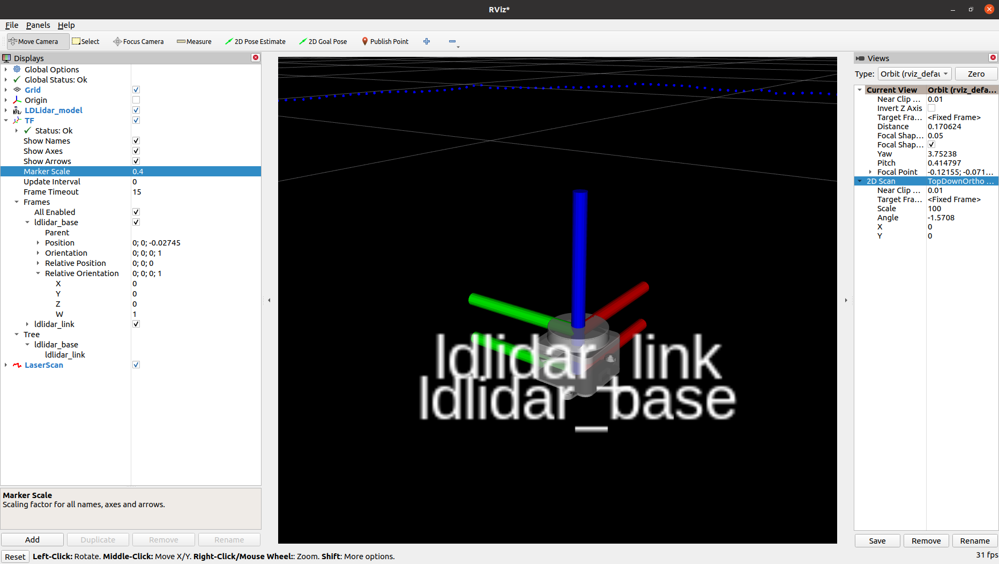
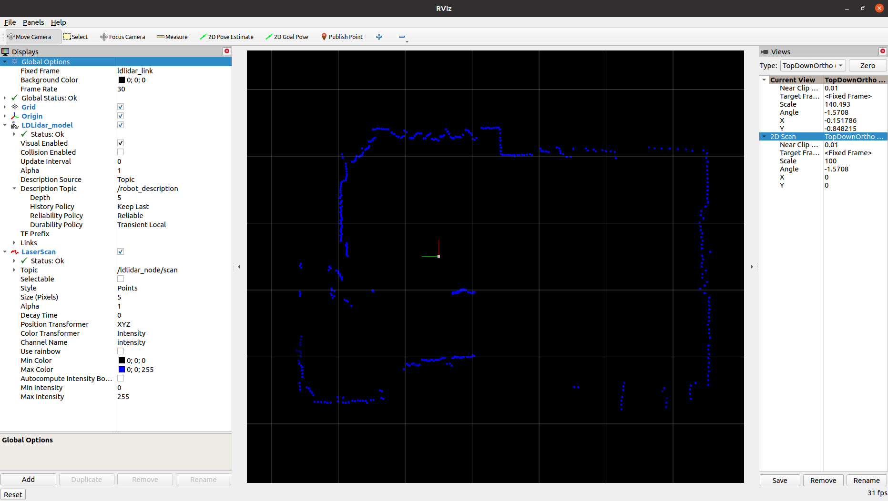

<h1 align="center">
  ldrobot-lidar-ros2
</h1>

<h4 align="center">ROS2 package for LDRobot lidar. Based on Nav2 Lifecycle nodes</h4>

  <a href="#get-the-lidar">Get the lidar</a> •
  <a href="#the-node-in-action">YouTube videos</a> •
  <a href="#install-the-node">Install</a> •
  <a href="#start-the-node">Start the Node</a> •
  <a href="#parameters">Parameters</a> •
  <a href="#display-scan-on-rviz2">RViz2</a> •  
  <a href="#integrate-the-node-in-your-robot">Robot integration</a>

 

This node is designed to work with the DToF 2D Lidar sensors [LD19](https://www.ldrobot.com/product/en/112) made by [LDRobot](https://www.ldrobot.com/en).

It can work also with the [LD06](https://www.ldrobot.com/product/en/98) model, but no tests have been performed with it. LD06 cannot work outdoor.

LD19             |  LD06
:-------------------------:|:-------------------------:
  |  

## Get the lidar

My lidar (LD19) comes from the [LDRobot kickstarter campaing](https://www.kickstarter.com/projects/ldrobot/ld-air-lidar-360-tof-sensor-for-all-robotic-applications) ended in 2021.

LDRobot then created also an [Indiegogo campaign](https://www.indiegogo.com/projects/ld-air-lidar-tof-sensor-for-robotic-applications--3#/) for the LD19.

LDRobot today distributes the Lidar through third-party resellers:

* Waveshare: [LD19](https://www.waveshare.com/wiki/DTOF_LIDAR_LD19)
* Innomaker: [LD19](https://www.inno-maker.com/product/lidar-ld06/)
* Other: [Search on Google](https://www.google.com/search?q=ld19+lidar&newwindow=1&sxsrf=ALiCzsb2xd4qTTA78N00mP9-PP5HY4axZw:1669710673586&source=lnms&tbm=shop&sa=X&ved=2ahUKEwjYns78_NL7AhVLVfEDHf2PDk8Q_AUoA3oECAIQBQ&cshid=1669710734415350&biw=1862&bih=882&dpr=1)

## The node in action

LD19 Lifecycle            |  LD19 outdoor
:-------------------------:|:-------------------------:
 | 

## Install the node

The node is designed to work in [ROS2 Humble](https://docs.ros.org/en/humble/index.html).

Clone the repository in your ROS2 workspace:

    cd ~/ros2_ws/src/ #use your current ros2 workspace folder
    git clone https://github.com/Myzhar/ldrobot-lidar-ros2.git

Add dependencies:

    sudo apt install libudev-dev

Install the udev rules

    cd ~/ros2_ws/src/ldrobot-lidar-ros2/scripts/
    ./create_udev_rules.sh

Build the packages:

    cd ~/ros2_ws/
    rosdep install --from-paths src --ignore-src -r -y
    colcon build --symlink-install --cmake-args=-DCMAKE_BUILD_TYPE=Release

Update the environment variables:

    echo source $(pwd)/install/local_setup.bash >> ~/.bashrc
    source ~/.bashrc

## Start the node

### Default parameters

Open a terminal console and enter the following command:

    ros2 run ldlidar_node ldlidar_node

the `ldlidar` node is based on the [`ROS2 lifecycle` architecture](https://design.ros2.org/articles/node_lifecycle.html), hence it starts in the `UNCONFIGURED` state.
To configure the node, setting all the parameters to the default value, trying to estabilish a connection, and activating the scan publisher, the lifecycle services must be called.

Open a new terminal console and enter the following command: 

    ros2 lifecycle set /lidar_node configure

`Transitioning successful` is returned if the node is correctly configured and the connection is estabilished, `Transitioning failed` in case of errors. Look at the node log for information about eventual connection problems.

The node is now in the `INACTIVE` state, enter the following command to activate:

    ros2 lifecycle set /lidar_node activate
    
The node is now activated and the `/ldlidar_node/scan` topic of type `sensor_msgs/msg/LaserScan` is available to be subscribed.

### Launch file with YAML parameters

The default values of the [parameters of the node](#parameters) can be modified by editing the file [`ldlidar.yaml`](ldlidar_node/config/ldlidar.yaml).

Open a terminal console and enter the following command to start the node with customized parameters:

    ros2 launch ldlidar_node ldlidar.launch.py
    
The [`ldlidar.yaml`](ldlidar_node/config/ldlidar.yaml) script also starts a `robot_state_publisher` node that provides the static TF transform of the LDLidar [`ldlidar_base`->`ldlidar_link`], and provides the ldlidar description in the `/robot_description`.

### Launch file with YAML parameters and Lifecycle manager

Thanks to the [NAV2](https://navigation.ros.org/index.html) project it is possible to launch a [`lifecycle_manager`](https://navigation.ros.org/configuration/packages/configuring-lifecycle.html) node that is taking care of processing the state transitions described above.

An example launch file is provided, [`ldlidar_with_mgr.launch.py`](ldlidar_node/launch/ldlidar_with_mgr.launch.py), that illustrates how to start a `ldlidar_node` that loads the parameters from the `ldlidar.yaml` file, and starts the `lifecycle_manager` correctly configured with the file [`lifecycle_mgr.yaml`](ldlidar_node/config/lifecycle_mgr.yaml) to manage the lifecycle processing:

    ros2 launch ldlidar_node ldlidar_with_mgr.launch.py

The `ldlidar_with_mgr.launch.py` script automatically starts the `ldlidar_node` by including the `ldlidar.launch.py` launch file.

## Parameters

Following the list of node parameters:

* **`general.debug_mode`**: set to `true` to activate debug messages
* **`comm.direct_serial`**: set to `false` to use the USB <-> UART converter, `true` for direct UART connection 
* **`comm.serial_port`**: the serial port path if using direct UART connection
* **`lidar.frame_id`**: TF frame name for the lidar
* **`lidar.rot_verse`**: 0 -> `CLOCKWISE` / 1 -> `COUNTERCLOCKWISE` [ROS STANDARD]
* **`lidar.units`**: 0 -> `MILLIMETERS` / 1 -> `CENTIMETERS` / 2 -> `METERS` [ROS STANDARD]

## Display scan on RVIZ2

The launch file `ldlidar_rviz2.launch.py` starts the `ldlidar_node` node, the `lifecycle_manager` node, and a precofigured instance of RViz2 to display the 2D laser scan provided by the LDRobot sensors. This is an example to demonstrate how to correctly setup RViz2 to be used with the `ldlidar_node` node.

Open a terminal console and enter the following command:

    ros2 launch ldlidar_node ldlidar_rviz2.launch.py

## Integrate the node in your robot

Follow the following procedure, to integrate the `ldlidar_node` in a robot configuration:

* Provide a TF transform from `base_link` to `ldlidar_base`, that is placed in the center of the base of the lidar scanner. The `ldlidar_base` -> `ldlidar_link` transform is provided by the `robot_state_publisher` started by the `ldlidar.launch.py` launch file.
* Modify the [`ldlidar.yaml`](ldlidar_node/config/ldlidar.yaml) to match the configuration of the robot.
* Include the [`ldlidar.launch.py`](ldlidar_node/launch/ldlidar.launch.py) in the bringup launch file of the robot. Follow the [provided example](#launch-file-with-yaml-parameters-and-lifecycle-manager).
* Handle lifecycle to correctly start the node. You can use the Nav2 `lifecycle_manager`, by including it in the bringup launch file. Follow the [provided example](#launch-file-with-yaml-parameters-and-lifecycle-manager).
* Enjoy your working system

